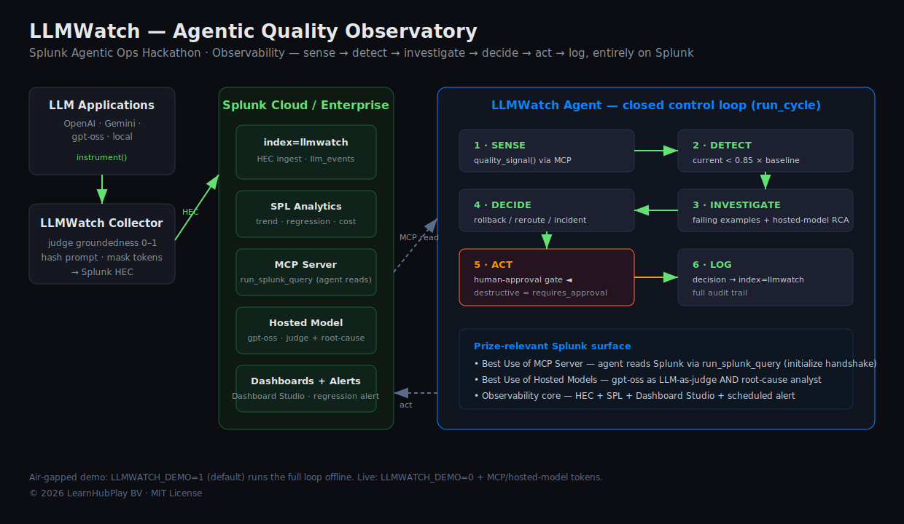

# LLMWatch — Agentic Quality Observatory for Production LLMs

<p>
  
  
  
  
  
  
  
  
</p>

> **Splunk Agentic Ops Hackathon · Observability track**
> *Your LLM got worse last night. Splunk saw it — and rolled it back.*

**Built with:**
`Splunk HEC` · `SPL` · `Splunk MCP Server` · `Splunk Hosted Models` · `Dashboard Studio` · `Splunk Alerts` · `Python 3.10+` · `requests` · `pytest`

**By [Manoj Mallick](https://github.com/manojmallick) · LearnHubPlay BV**

LLM answer quality degrades **silently**. A model update, a prompt change, or a
drifting RAG index can drop groundedness 20–30% with no error, no red dashboard,
no alert. Teams find out from customer complaints, not telemetry.

**LLMWatch** instruments every LLM call into Splunk, then runs an **agent** that
closes the loop: it senses regressions, root-causes them, and remediates — on
Splunk infrastructure, end to end.

---

## Why this is *agentic ops*, not a dashboard

Most monitoring stops at "turn a card red and email a human." LLMWatch's agent
runs a real control loop every cycle:

```
                ┌──────────────────────────────────────────────┐
   LLM apps     │              LLMWatch Agent                   │
 (any provider) │                                               │
      │ instrument                                              │
      ▼         │   1. SENSE       Splunk MCP Server ──┐        │
  Collector ───────► HEC ─► index=llmwatch             │ SPL    │
      │         │                                       ▼        │
      ▼         │   2. DETECT      current vs 24h baseline       │
 Splunk Cloud / │   3. INVESTIGATE failing calls (MCP) +         │
 Enterprise     │                  Splunk hosted model root-cause│
   ├─ SPL       │   4. DECIDE      rollback / reroute / incident │
   ├─ Dashboards│   5. ACT         ► human-approval gate ◄       │
   └─ Alerts    │   6. LOG         decision → index=llmwatch     │
                └──────────────────────────────────────────────┘
```

**Splunk capabilities used**

| Capability | Where | Prize relevance |
|---|---|---|
| **Splunk MCP Server** | `mcp_client.py` — agent queries Splunk via MCP/JSON-RPC | *Best Use of Splunk MCP Server* |
| **Splunk Hosted Models** | `judge.py` — `gpt-oss` as LLM-as-judge **and** root-cause analyst | *Best Use of Splunk Hosted Models* |
| **HEC + SPL** | `collector.py`, `spl/` — ingestion + analytics | Observability core |
| **Dashboard Studio** | `dashboards/` design specs | Design |
| **Alerts / modular input** | `run_cycle()` on a schedule | Automated response |

---

## Run it (zero network, ~5 seconds)

```bash
cd llmwatch
python demo.py          # human-approval gate ON  → action staged
python demo.py --auto   # autonomous             → rollback executed
```

`demo.py` instruments sample calls, then runs the agent against a simulated
regression (v2.3 groundedness `0.84 → 0.61`, −27%). You'll watch it sense →
detect → investigate → decide → act → log. **No Splunk instance or API key
required** — `LLMWATCH_DEMO=1` is the default (CLAUDE.md air-gapped rule).

### Against a live Splunk instance — verified ✅

One command (local Splunk Enterprise): enables HEC, seeds events, runs the agent
against **live SPL**, and reads the audit row back out of Splunk.

```bash
pip install -r requirements.txt
SPLUNK_USER=admin SPLUNK_PASSWORD=*** ./run_live.sh
```

Verified live output (real `index=llmwatch`):

```
SENSE  · pulled 2 model signals from Splunk [REST]
DETECT · gemini-2.0-flash-v2.3 dropped 52.1% (0.84 -> 0.402) — REGRESSION
INVESTIGATE · gpt-oss root cause: authentication/authorization [HIGH] -> rollback
ACT    · executed: Active model v2.3 -> v2.2. Traffic restored.
```

On **Splunk Cloud** the agent reads over the MCP Server instead of REST:

```bash
export LLMWATCH_DEMO=0
export SPLUNK_HEC_URL=...      SPLUNK_HEC_TOKEN=...
# Splunk Cloud MCP endpoint pattern (token audience must be 'mcp'):
export SPLUNK_MCP_URL=https://<deployment>.api.scs.splunk.com/<deployment>/mcp/v1/
export SPLUNK_MCP_TOKEN=...
export SPLUNK_HOSTED_MODEL=gpt-oss-120b
python demo.py --auto
```

The MCP client performs the streamable-HTTP `initialize` handshake (session id +
`notifications/initialized`) before any `run_splunk_query` call, and parses both
JSON and SSE replies — so it connects to a real Splunk MCP Server, not just the
demo. Secrets come **only** from the environment — never hardcoded, always masked
in logs (`Config.mask_token`). Prompts are hashed before logging.

---

## The quality metric

Groundedness, 0–1, via LLM-as-judge (a Splunk hosted model in production). The
methodology is validated against a labelled benchmark:

| Condition | Groundedness |
|---|---|
| **With** retrieval context | **0.621** |
| **Without** context | **0.158** |

This single score feeds Splunk anomaly detection and the agent's detection step.

---

## Repository layout

```
llmwatch/
├── llmwatch/
│   ├── config.py        env-only secrets, thresholds, demo mode
│   ├── collector.py     instrument LLM calls → HEC  (privacy-safe)
│   ├── judge.py         Splunk hosted-model LLM-as-judge + root-cause
│   ├── mcp_client.py    Splunk MCP Server client (agent reads Splunk)
│   ├── actions.py       rollback / reroute / incident (+ approval gate)
│   └── agent.py         the agentic loop  ← the core
├── demo.py              runnable end-to-end demo (no network)
├── spl/                 SPL queries + alert definitions
├── dashboards/          Dashboard Studio dashboard (importable JSON) + specs
└── docs/                architecture.svg (rendered diagram)
```

**Importable dashboard:** [`dashboards/llmwatch_observatory.json`](dashboards/llmwatch_observatory.json)
— Dashboards → Create New → Dashboard Studio → Source → paste. Six panels
(groundedness, hallucination rate, context lift, per-model trend, model
comparison, and the agent's decision audit trail) wired to the SPL in `spl/`.

**Architecture:** 

## Responsible autonomy

Destructive actions (`rollback`, `reroute`) carry `requires_approval=True`. Run
non-autonomously and the agent **stages** the action for a human; only `--auto`
lets it remediate on its own. Every decision is written back to
`index=llmwatch` as an audit trail.

---

*© 2026 LearnHubPlay BV · MIT License*
