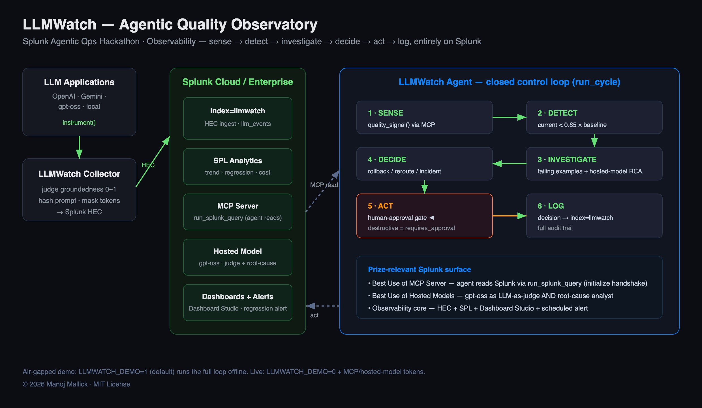

# LLMWatch — Architecture Diagram



LLMWatch is an agentic LLM-quality observatory built on Splunk. It instruments
every LLM call, logs quality metrics to Splunk, and runs an autonomous agent that
detects quality regressions, root-causes them with a Splunk hosted model, and
remediates — all on Splunk infrastructure.

---

## 1. How the application interacts with Splunk

| Splunk capability | Interaction |
|---|---|
| **HTTP Event Collector (HEC)** | `llmwatch/collector.py` POSTs one privacy-safe event per LLM call to `index=llmwatch` (prompts hashed; secrets env-only). |
| **SPL** | All analytics — quality trend, regression detection, hallucination rate, cost/quality — are SPL queries (`spl/queries.spl`, dashboard data sources). |
| **Splunk MCP Server** | On Splunk Cloud, the agent reads Splunk over MCP (JSON-RPC, `initialize` handshake → `tools/call run_splunk_query`) — `llmwatch/mcp_client.py`. |
| **REST search API** | On local Splunk Enterprise (no MCP), the same SPL runs via `/services/search/jobs/export` — `llmwatch/splunk_rest.py`. |
| **Splunk Hosted Models** | `gpt-oss` is the LLM-as-judge groundedness scorer **and** the regression root-cause analyst — `llmwatch/judge.py`. |
| **Dashboard Studio** | Three dashboards render live from `index=llmwatch` — `dashboards/*.json`. |
| **Alerts / modular input** | A scheduled search fires the agent's `run_cycle` — `spl/alert_quality_regression.xml`. |

## 2. How AI models / agents are integrated

- **LLM-as-judge (Splunk hosted model):** every logged call is scored 0–1 for
  groundedness by a Splunk hosted `gpt-oss` model (heuristic fallback offline).
- **The LLMWatch Agent** (`llmwatch/agent.py`) runs a closed control loop:
  **SENSE** (read Splunk via MCP/REST) → **DETECT** (current vs 24h baseline) →
  **INVESTIGATE** (pull failing calls + hosted-model root cause) → **DECIDE**
  (rollback / reroute / incident) → **ACT** (with a human-approval gate) →
  **LOG** (write the decision back to Splunk as an audit trail).

## 3. Data flow between services, APIs, and components

```
LLM apps (any provider)
   │  instrument (prompt hashed, privacy-safe)
   ▼
Collector ──HEC──▶ Splunk  index=llmwatch ─────────────┐
   ▲                                                    │ SPL
   │ (rollback / reroute applied to the model registry) ▼
LLMWatch Agent ◀── MCP Server (Cloud) / REST search (local) ── reads quality signal
   │  ├─ root-cause via Splunk hosted model (gpt-oss)
   │  └─ decision + action ──HEC──▶ index=llmwatch (sourcetype=llm_agent_actions)
   ▼
Dashboards (Dashboard Studio) · Alerts ──▶ PagerDuty / Slack / email
```

**End-to-end:** LLM call → HEC → `index=llmwatch` → agent reads via MCP/REST →
hosted-model root cause → autonomous remediation → audit logged back to Splunk →
visualized in Dashboard Studio and alerted. Verified live on Splunk Enterprise
10.4 (`scripts/setup_splunk.py` + `run_live.sh`).
